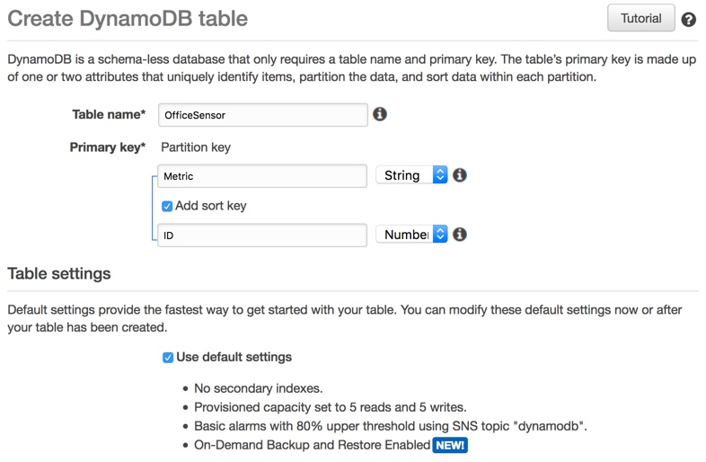
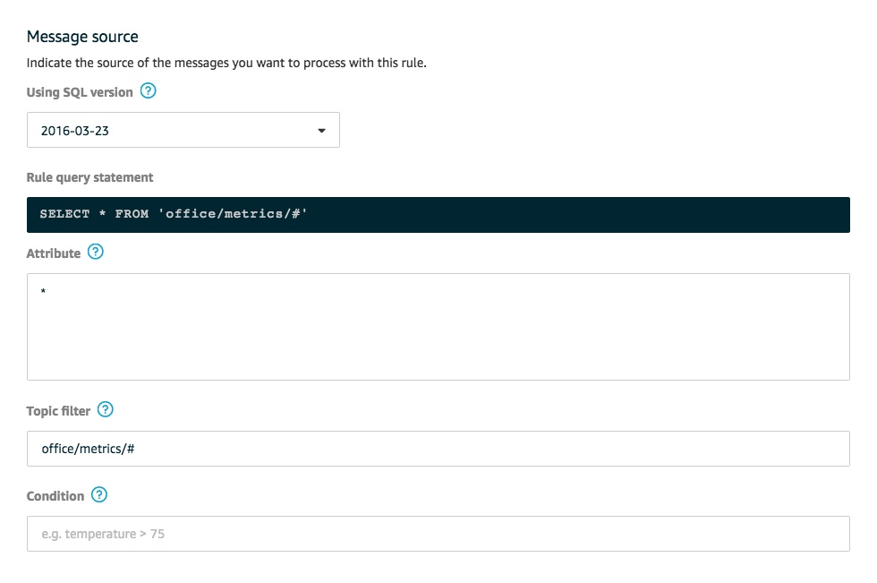
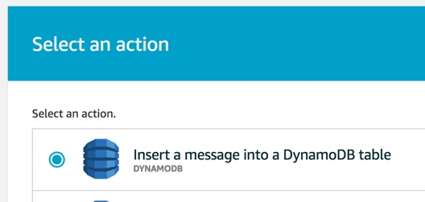
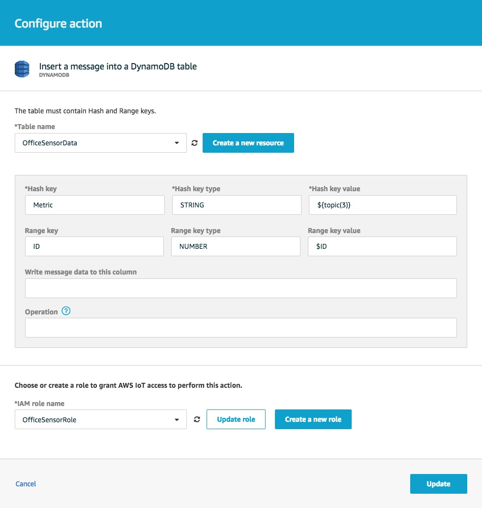

## Office Sensor Web App

### Overview
In this example, you create and deploy a simple web application that subscribes to several AWS IoT MQTT topics, reads data from an AWS DynamoDB table, and updates tables and graphs in a Flask-powered web interface.

Note that, in order to run the application, you need to have deployed and started the [office sensor](../sensor/) application on your Raspberry Pi. 

You can start the web app from any machine with an internet connection. In this example, AWS Elastic Beanstalk deploys the application to an AWS EC2 instance.

The following tree graph visualizes the directory structure of the web application:

```bash
flask
├── application.py
├── certs
│   ├── certificate.pem.crt
│   ├── private.pem.key
│   ├── public.pem.key
│   └── root-ca.cer
├── config.py
├── README.md
├── requirements.txt
├── templates
│   ├── index.html
│   └── _nav.html
└── utils.py
```

### Requirements
Several third-party Python libraries are required to run the application. We recommend that you use `virtualenv` to manage these libraries. Create a virtual environment with `virtualenv`:

```bash
~/flask$ virtualenv virt
~/flask$ source virt/bin/activate
(virt) ~/flask$
```
When you see `(virt)` at the beginning of your command prompt, you are working in the virtual environment, and you can install the following libraries with `pip`:
* `boto3`
* `AWSIoTPythonSDK`
* `bokeh`
* `pandas`
* `flask`

You can view all the libraries installed to the virtual environment with `pip freeze`:

```bash
(virt) ~/flask$ pip freeze
AWSIoTPythonSDK==1.4.0
bokeh==0.13.0
boto3==1.8.3
botocore==1.11.7
click==6.7
docutils==0.14
Flask==1.0.2
itsdangerous==0.24
Jinja2==2.10
jmespath==0.9.3
MarkupSafe==1.0
numpy==1.15.1
packaging==17.1
pandas==0.23.4
pyparsing==2.2.0
python-dateutil==2.7.3
pytz==2018.5
PyYAML==3.13
s3transfer==0.1.13
six==1.11.0
tornado==5.1
urllib3==1.23
Werkzeug==0.14.1
```

For AWS Elastic Beanstalk to properly set up your environment, your package will need a `requirements.txt` file that lists your required libraries. You can write the output from `pip freeze` to `requirements.txt`:

```bash
(virt) ~/flask$ pip freeze > requirements.txt
```

### Application Components
[`application.py`](application.py) is the main application file. The code in `application.py` is separated into three distinct parts, one for each of three services:
* An AWS DynamoDB client that reads data from a database that stores historical weather data from the [office sensor](../sensor/)
* An AWS IoT MQTT client that subscribes to the office sensor's MQTT topic
* A Flask web server that serves a web interface for monitoring real-time data

[`utils.py`](utils.py) contains helper functions for processing and visualizing data. These functions leverage the popular `bokeh` and `pandas` libraries.


#### AWS DynamoDB

##### Create a table
You need to create an AWS DynamoDB table to store data that is published to the AWS IoT Core MQTT topic. To create a table, open the AWS DynamoDB console, and select **Create Table**.

On the **Create DynamoDB table** page, name the table "OfficeSensor". Set the partition key to "Metric", and the sort key to "ID". The partition key separates records by the type of metric (Temperature, Humidity, or Pressure), and the sort key sorts the partitioned records by ID.

---



---

##### Create a rule
You need to create a rule to send the data in AWS IoT Core to AWS DynamoDB.

Open the AWS IoT Core console, and select **Act**. From the **Rules** page, select **Create Rule**. Give the rule a name (and a description, if you like). 

Under **Message Source**, set the query to select all attributes from all subtopics of the `office/metrics` MQTT topic:

---



---

Under **Set one or more actions**, select **Add action**. From the list of actions on the **Select an action** page, select "Insert a message into a DynamoDB table" from the list of actions:

---



---

Select **Configure action** at the bottom of the page.

From the **Configure action** page, select your table from the **Table name** drop-down menu, and fill out the **Hash key value** and **Range key value** fields to reference the metric subtopic (`${topic(3)}`) and "ID" attribute (`$ID`) of the message:

---



---

The hash key matches the metric subtopic to the "Metric" partition key in the AWS DynamoDB table, and the range key matches the "ID" attribute to the sort key.

Select an existing role and update it, or create a new role at the bottom of the page. To add the action, select **Add action**.

**Note:** `application.py` references the example `config.py` file when specifying the AWS access keys and region to initialize the AWS DynamoDB client. Make sure that these credentials are defined correctly in `config.py`. Even if the `~/.aws/config` file on your local machine specifies this configuration information, the EC2 instance that AWS Elastic Beanstalk creates does not have a `~/.aws/config` file by default.

#### MQTT Client
The application subscribes to all subtopics of `office/metrics` and registers a callback function with the MQTT client API's `subscribe()` method. Upon hearing a message on `office/metrics`, the callback function loads data from the AWS DynamoDB table and calculates descriptive statistics for intervals of data.

You need to register your application as an IoT thing in the console to obtain the authentication keys and certificates needed to interact with the MQTT client API. To register your thing, follow the steps in "AWS IoT Core Console: Register Thing" in the [office sensor README](/sensor/README.md). Be sure to replace the template authentication certificates and keys in `certs` with valid ones.

#### Flask
A simple Flask instance populates an HTML template with interval- and metric-specific data. 

### Deployment
You can use AWS Elastic Beanstalk to deploy your application with AWS services. To install the AWS Elastic Beanstalk CLI to your virtual environment, use the following command:

```bash
(virt) ~/flask$ pip install awsebcli --upgrade
```

To initialize your Flask application with the AWS Elastic Beanstalk CLI, use the following command:

```bash
(virt) ~/flask$ eb init -p python-3.6 flask-app --region us-west-2
```

After you have initialized your application, you can create the AWS Elastic Beanstalk environment:

```bash
(virt) ~/flask$ eb create flask-env
```

AWS Elastic Beanstalk creates the following resources:
* EC2 instance
* Instance security group
* Load balancer
* Load balancer security group
* Auto Scaling group
* Amazon S3 Bucket
* Amazon CloudWatch alarms
* AWS CloudFormation stack
* Domain name

After AWS Elastic Beanstalk finishes creating your environment, you can open the application with the AWS Elastic Beanstalk CLI:

```bash
(virt) ~/flask$ eb open
```

For more information about deploying a Flask application to AWS Elastic Beanstalk, see [Deploying a Flask Application to AWS Elastic Beanstalk](https://docs.aws.amazon.com/elasticbeanstalk/latest/dg/create-deploy-python-flask.html).
